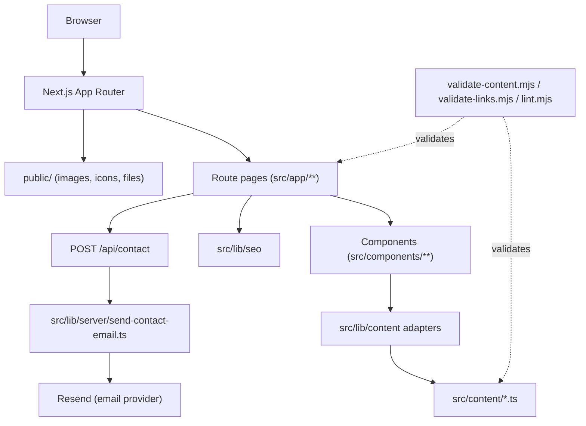

# Architecture

## Purpose

This document describes the actual current architecture of `my-website-2026`: a single Next.js
App Router website with local typed content, adapter functions, presentational components, and
one minimal server API route for contact-form email delivery.

## Repository shape

```
src/
  app/            route pages, layouts, metadata, API route, sitemap, robots
  components/     presentational components, grouped by area
  content/        local typed content records (source of truth)
  lib/
    content/      adapter functions that read src/content and shape view models
    seo/          metadata, Open Graph, structured data, canonical URL helpers
    server/       server-only helpers (contact email sending)
    utils.ts      small shared utilities
  types/          shared TypeScript types for content/domain models
public/           static assets (images, icons, files)
scripts/          validation, release-readiness, and asset-generation scripts
tests/            Vitest unit/component tests (tests/content) and Playwright e2e (tests/e2e)
docs/             this documentation
```

## Layers, in dependency order

1. **`types`** — shared TypeScript interfaces for content/domain records (profile, project,
   product, publication, contact, roadmap, SEO). No runtime code.
2. **`content`** — local, typed, literal data modules under `src/content`. No React, no adapter
   logic — just structured records and the `routes` constant.
3. **`lib/content` adapters** — pure functions that read `src/content`, validate shape
   (`validateProjects`, `validateProductFamilies`, `validateProductIndex`,
   `validatePublications`, `validateRoadmaps`, …), sort/filter, and return view models. Adapters
   never import React components; components never import `src/content` directly.
4. **`lib/seo`** — builds page metadata (`buildPageMetadata`), Open Graph images, JSON-LD
   structured data, and canonical/absolute URLs from `NEXT_PUBLIC_SITE_URL`.
5. **`components/ui`** — reusable presentational primitives (`Card`, `Badge`, `LinkButton`,
   `SectionHeader`, `Container`) with no content-domain knowledge.
6. **Feature components** — `components/projects`, `components/products`, `components/publications`,
   `components/contact`, `components/roadmap`, `components/sections` render typed content passed
   in as props.
7. **`components/layout` + `components/theme`** — `SiteShell`, `Header`, `Footer`, `NavLink`,
   `SiteLogoMark`, `ThemeProvider`/`AppearanceControl`/`theme-script`. Own the page shell, navigation,
   and palette / light-dark-system switching persisted under the existing palette and theme keys. Shared static palette styling lives in src/styles/utilities.css.
8. **`src/app`** — route pages compose feature components with data from adapters; owns
   route-level `metadata`, `sitemap.ts`, `robots.ts`, and the single API route.

## Dependency rules

- Lower layers must not import higher layers (`types` and `content` never import components).
- `src/content` must not import React components.
- UI primitives (`components/ui`) must not import project-specific content types.
- Pages compose; they do not define their own structured data arrays inline (enforced by
  `scripts/lint.mjs` and `scripts/validate-content.mjs`, which scan route files for hardcoded
  `const projects = [...]`-style literals).

## Site architecture diagram



## Content flow

`src/content` → `src/lib/content` adapters (validate + shape) → page component (data-fetching,
server component) → feature components (presentational, receive props) → rendered HTML. No page
component defines structured data inline; no component imports `src/content` directly.

## The contact form / API layer

`/contact`'s `ContactForm` client component performs client-side validation, then `POST`s JSON to
`/api/contact` (`src/app/api/contact/route.ts`). The route re-validates server-side (including a
honeypot field), then calls `sendContactEmail` (`src/lib/server/send-contact-email.ts`), which
sends via the `resend` package. Missing configuration (`RESEND_API_KEY`, `CONTACT_FROM_EMAIL`)
returns a clear, non-secret config-error response rather than failing silently. See
`docs/DIAGRAMS.md` for the full request/response flow diagram and `docs/CONTRACT.md` for the
exact API contract.

## Validation and release-readiness layer

- `scripts/lint.mjs` — custom repository lint rules (design-token usage, forbidden hardcoded
  content in routes, stale-pattern checks).
- `scripts/validate-content.mjs` — required-field and shape checks across all `src/content`
  modules.
- `scripts/validate-links.mjs` — internal route existence, external URL well-formedness, SEO
  metadata completeness.
- `scripts/check-release-readiness.mjs` — orchestrates required-path checks, forbidden-path
  checks, and the full quality-gate chain (typecheck → lint → validate:content → validate:links →
  test → build). See `docs/RELEASE_READINESS.md`.

## Integration points

- **GitHub** — publication target for the repository; also the target of the profile "GitHub"
  link (`src/content/contact.ts`) and each my-dev-kit module's GitHub link
  (`src/content/products.ts`).
- **Vercel** — deployment target (not performed by local tooling).
- **Resend** — contact-form email delivery provider.
- **Browser `localStorage`** — theme preference persistence only; no other client-side storage.
- **External links** — npm package links, GitHub repository links, LinkedIn — all use
  `target="_blank" rel="noreferrer"`.

## Architectural invariants

- Content invariant: all page copy and structured records live in `src/content`, not inline in
  components or pages.
- Roadmap invariant: the full lane/phase/milestone roadmap model (`src/content/roadmaps.ts`) is
  the single source of truth for roadmap-preview data; per-product version history
  (`ProductModule.versionRoadmap`) is a separate, simpler model rendered inside each product
  panel's collapsible Roadmap section on `/projects/my-dev-kit`.
- Design invariant: soft grey light mode, charcoal dark mode, restrained violet/cyan accents —
  see `docs/DESIGN.md`.
- Accessibility invariant: semantic landmarks, one `h1` per route, visible focus states,
  keyboard-reachable interactive elements, status conveyed as text (not color alone).
- SEO/route invariant: `sitemap.ts` derives strictly from `routeMetadata`
  (`src/lib/seo/metadata.ts`) — it cannot list a route that isn't part of the real route table.

## Out of scope for this project

- No CMS, no database, no ORM, no Python/secondary-language service.
- No monorepo/workspace tooling.
- No deployment automation beyond the (manual, out-of-band) Vercel GitHub integration.
