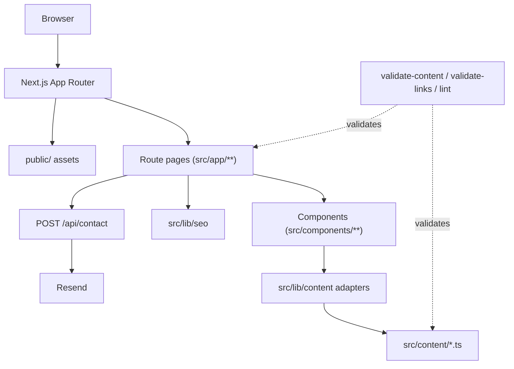
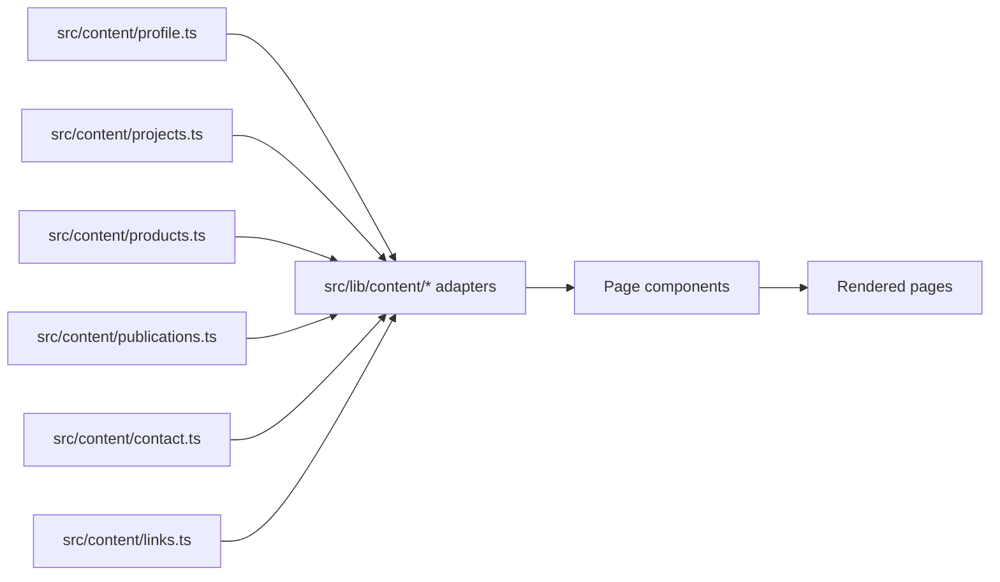
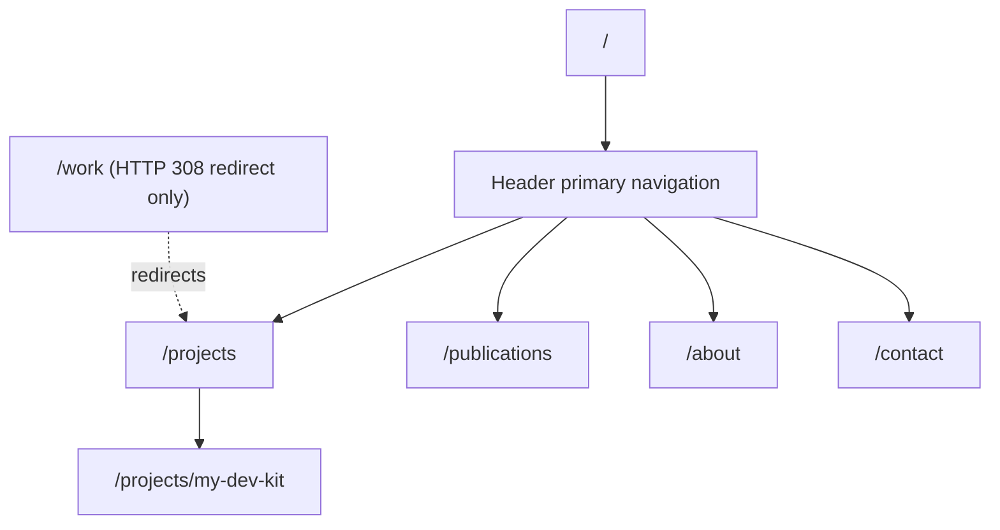
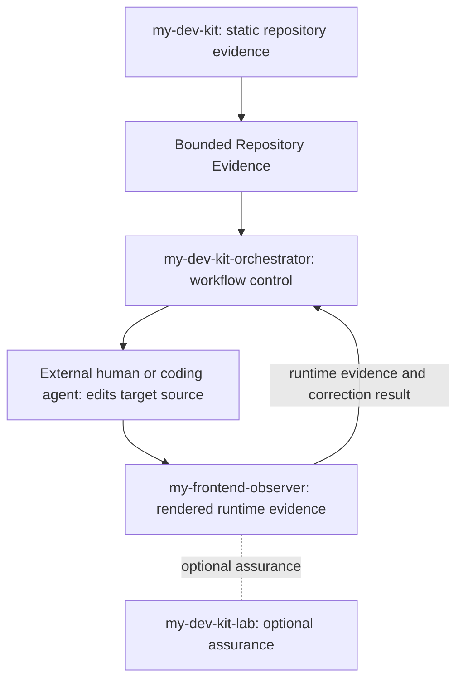
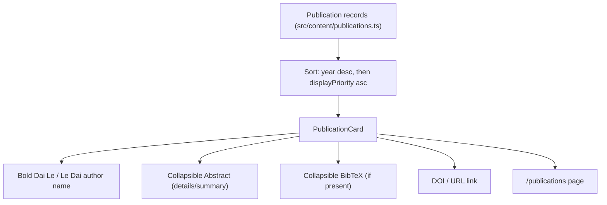
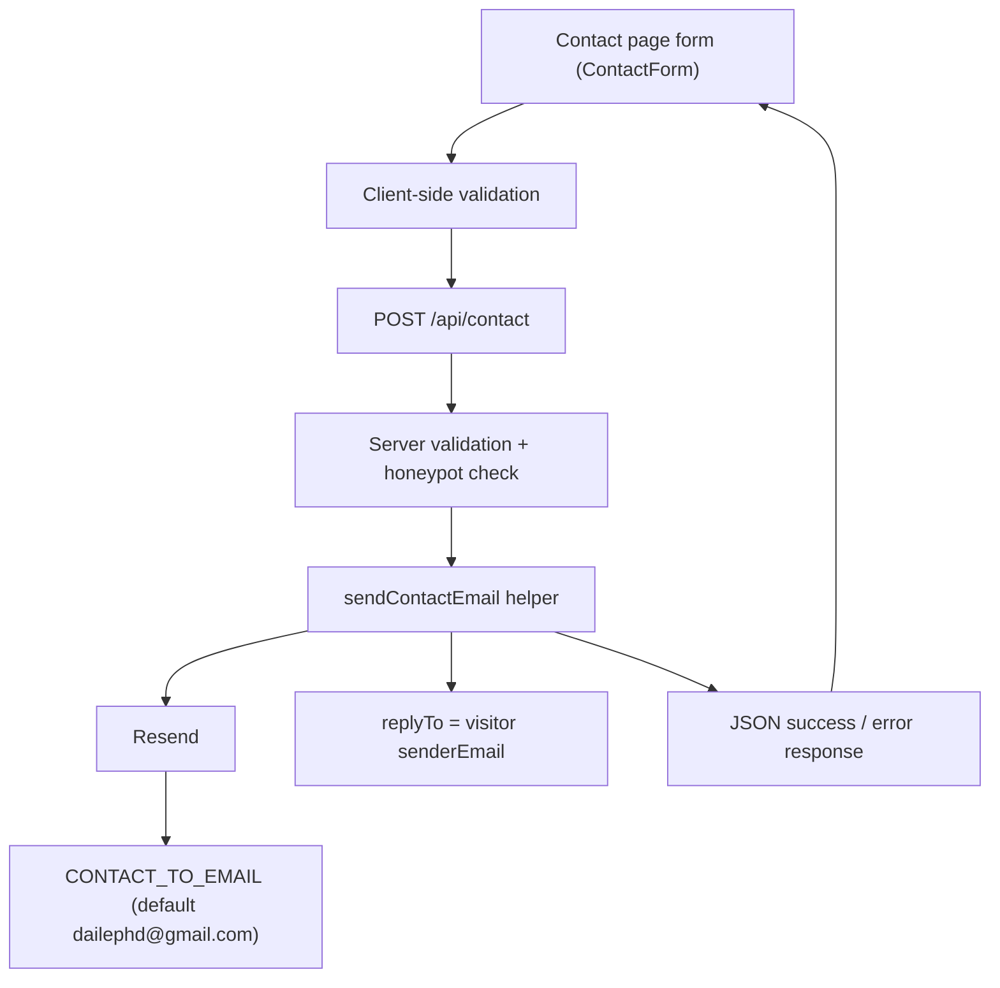
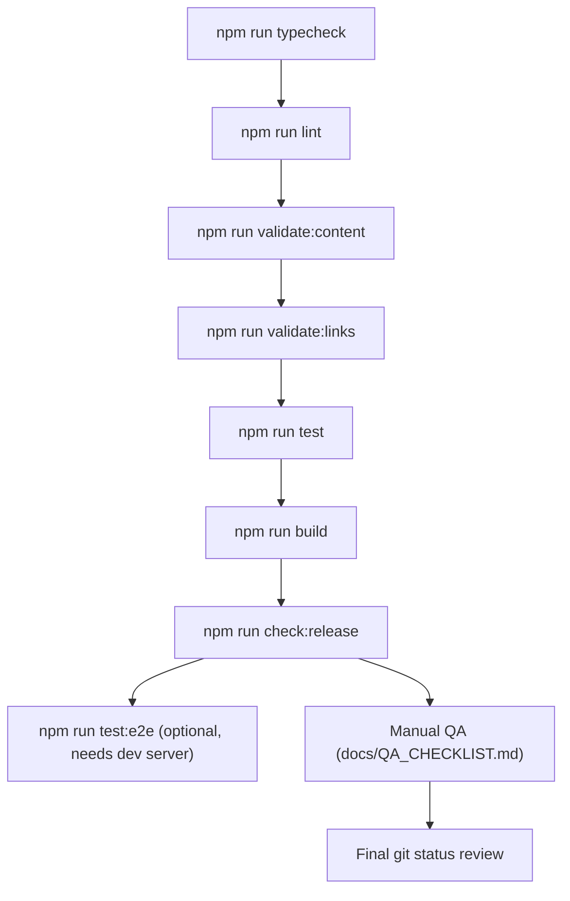
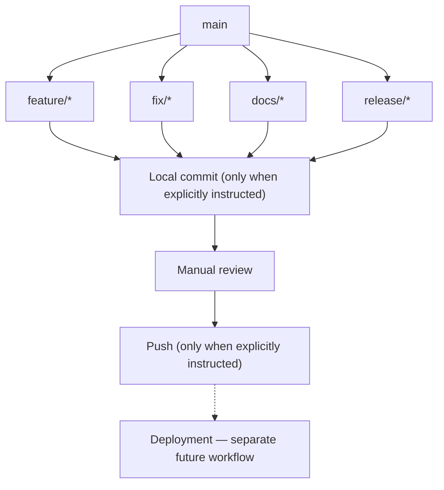

# Diagrams

All diagrams in this document are Mermaid, kept intentionally small and labeled with plain text
— no secrets, no fictional services, and nothing that doesn't match the current implementation
(cross-referenced against `docs/ARCHITECTURE.md`, `docs/CONTRACT.md`, and the source under
`src/`).

## 1. Site architecture

## 2. Content flow

## 3. Routing / navigation structure

## 4. Project relationship (my-dev-kit ecosystem)

## 5. Publication rendering flow

## 6. Contact form email flow

## 7. Release-readiness workflow

## 8. Git branch workflow

See `docs/BRANCHING.md` for the naming rules behind this diagram.
